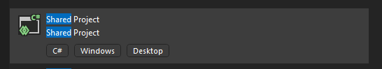

## Preparation Steps

1. [Install Power Platform CLI](https://learn.microsoft.com/en-us/power-platform/developer/cli/introduction?tabs=windows#install-microsoft-power-platform-cli)

## Getting Started:

1. Right click on your Solution , click `Add` -> `New Project`
2. Choose `Shared Project`

3. Input your Shared Project. It should be `ProjectName.SharedProject` -> Click Create